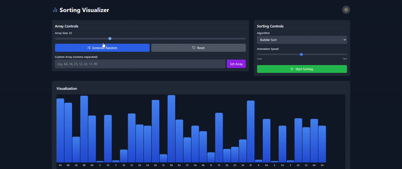

# 🔢 Sorting Visualizer


An interactive web application to **visualize sorting algorithms** in real-time, built using **React**, **TypeScript**, **TailwindCSS**, and **Vite**. This project helps you understand the inner workings of popular sorting algorithms through dynamic, animated visualizations.

🔗 **Live Demo**: [https://steady-khapse-fdc88a.netlify.app](https://steady-khapse-fdc88a.netlify.app)

---

## 🧠 Features

* 🔁 Visualize **7 sorting algorithms**:

  * Bubble Sort
  * Selection Sort
  * Insertion Sort
  * Merge Sort
  * Quick Sort
  * Heap Sort
  * Shell Sort
* 🎛️ Adjustable array size and animation speed
* 🌓 Dark/Light mode toggle
* 📊 Real-time sorting step animation
* 📖 Algorithm descriptions with time & space complexity
* 📱 Fully responsive design
* 🌈 Smooth animations and accessible UI

---

## 🛠 Tech Stack

| Tech         | Purpose               |
| ------------ | --------------------- |
| React 18.3   | UI Library            |
| TypeScript   | Type Safety           |
| Vite         | Fast Build Tool       |
| Tailwind CSS | Utility-first Styling |
| Lucide React | Icon Library          |
| Context API  | State Management      |

---

## 📂 Project Structure

```
sorting-visualizer/
├── public/
├── src/
│   ├── components/         # Reusable UI components
│   ├── contexts/           # Sorting and Theme context providers
│   ├── hooks/              # Custom hooks for reusable logic
│   ├── algorithms/         # Sorting algorithm implementations
│   ├── utils/              # Helper functions
│   ├── App.tsx             # Main app component
│   └── main.tsx            # App entry point
├── tailwind.config.js
├── postcss.config.js
├── tsconfig.json
└── vite.config.ts
```

---

## 🚀 Getting Started

### 1. Clone the Repository

```
git clone https://github.com/your-username/sorting-visualizer.git
cd sorting-visualizer
```

### 2. Install Dependencies

```
npm install
```

### 3. Start Development Server

```
npm run dev
```

Open [http://localhost:5173](http://localhost:5173) to view the app.

---

## 🎓 Key Learnings

### 📚 Algorithm Visualization

* Step-by-step representation of sorting processes
* Real-time comparison and swapping animations
* Complexity analysis for each algorithm

### ⚛️ React Development

* State management using Context API
* Reusable logic via custom hooks
* Performance optimization with memoization and effect cleanup

### 💅 UI/UX & Design

* Responsive layout using TailwindCSS
* Visual feedback and interactivity
* Dark mode and accessibility enhancements

---

## 🧪 Future Improvements

* Add more algorithms (e.g., Radix Sort, Counting Sort)
* Audio feedback for comparisons/swaps
* Theme customization panel
* Manual step-through control mode

---

## 🎥 Demo



---

## 📄 License

This project is open-source and available under the MIT License.

---

## 👏 Acknowledgements

Inspired by classic algorithm visualizer projects and built as a learning tool for developers who want to explore **algorithms**, **data structures**, and **modern web development**.

